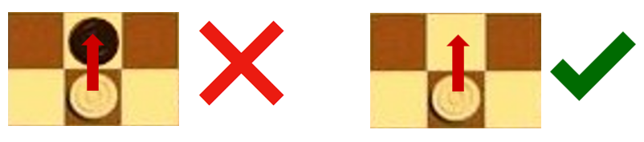

# MultiPions :vs:
## Simple Game with MinMaxIA
Inspiré de [ceci]( https://www.wikidebrouillard.org/wiki/Intelligence_artificielle_DIY_imbatable_%C3%A0_l%27hexapion)

***

## Le jeu
Le jeu « Multipion » est un jeu de société à deux joueurs plus précisément il s’agit d’un jeu de plateau. Il est composé d’un plateau caré d’un nombre de case décidé en amont par les joueurs et de deux couleurs de pions : Blanc et Noir.Les pions blanc étant ceux du premier joueur et les pions noir ceux du deuxième joueur. L’objectif est d’être le premier à aligner un pion dans la zone adverse ou avoir capturer tout les pions de l’adversaire. 

***

## GUI 

Voici une **vidéo** présentant le changement de vue ainsi qu’un match joueur contre IA de difficulté 4 

<https://www.youtube.com/watch?v=lj-vqztp01o>

  
L’interface propose un plateau avec déplacement des pions à la souris, visualisation des coups possible et dernier coup effectué. 
Un tableau présente les différents coups joués.
Une interface discrète montre le nombre de pions capturés.

Le premier menu propose la création d’une nouvelle partie, avec sélection du mode et de la taille du plateau par curseur. Tandis que le second propose la sauvegarde des coups joués en fichier texte, changement de vue ainsi que le changement de difficulté.

A la fin d’une partie, il est proposé de faire une nouvelle partie, on peut sauvegarder les coups joués en allant dans le menu option.

***

## Les règles

### Tour de jeu

Dans un tour, il possible d’effectuer une action parmi les deux suivantes :

La première action consiste à avancer son pion d’une case si aucun autre ne le gêne. Il est interdit de sauter par-dessus un pion n’y d’avoir deux pions l’un par-dessus l’autre. 

La deuxième action consiste à manger un pion de l’adversaire. Pour ce faire le joueur dont c’est le tour choisit un de ses pions. Si un pion adverse se trouve dans la diagonale avant gauche ou droite de ce pion alors il remplace le pion adverse par le sien. Il est interdit de manger un pion de son équipe ou de manger un pion en diagonal en reculant.

### Conditions de victoire

Il y a deux manières de gagner le jeu. Soit vous êtes le premier joueur qui aligne un pion dans la zone adverse. Soit vous avez mangé tous les pions adverse.

Pour ce faire un joueur dispose de deux actions avec chacun de ses pions. La première action consiste à avancer son mion en ligne droite. La deuxième consiste à manger un pion adverse 

***

## Les différentes classes

### La classe Coup
La classe Coup sert à effectuer l’action que le joueur actuel (Humain ou I.A.)  a décidé de faire. Ainsi une fois que le coup a été décidé elle renvoit les nouvelles coordonées du pion dans un format string.

### La classe Node
La classe Node sert à l’I.A.. Ellet détermine l’intérêt d’un coup et permet à l’I.A. de choisir le coup le plus intéressant.

### La classe Recherche_Coups
La classe Recherche_Coups à pour objectif de trouver l’ensemble des coups réalisable au multipion en respectant les règles de celui-ci. Pour cela elle travail avec la classe Regle. Au final elle renvoie une liste de tout les coups autorisés.

### La classe GUI
La classe GUI initialise le jeu et l’interface. Ainsi elle propose les différentes options comme le mode de jeu et définit l’image des pions. 

### La classe GUI_Pions
La classe GUI_Pions initialise la structuration des cases et le graphisme du plateau. 

### La classe Autres_Fonction
La classe Autre_Fonctions est composé de diverses fontcions. Elle commence par associer à colonne du plateau une lettre. Ensuite elle créé un fichier nommé « fichier » qui servira de résumé pour la partie. Et enfin il met le format du temps à jour.

### La classe Main
La classe main créer un nouveau jeu. Ensuite elle créer un plateau de taille 4 x 4 tout en définissant les différentes variables comme le VictoirePoid à 1 000 000 pour le poids de l’IA ou encore profondmin à 1 pour le profondeur minimum pour la difficultée de l’I.A.. Elle définit également les différentes fonctions static utilisé pour la suite du programme comme getTaille pour retourner la taille du plateau ou encore getGameMode() retournant le mode de jeu.

### La classe GetNodes
La classe GetNodes mets en place les nœuds. Elle définit le premier nœud nommé « racineNode » et lui attribue la valeur vide.

### La classe Jeu
La classe jeu est composée d’un constructeur et de plusieurs fonctions importantes comme ListenerMouseRelease qui récupère la localisation du clic souris ou encore CreationFichierCoupsjouee qui créer un fichier .txt contenant tous les coups joués par chacun des deux joueurs. Elle est l’une des classe principale du projet car elle regroupe de nombreuses fonctions clefs. 

### La classe MinMax
La classe MinMax est notre intelligence artificielle. Elle à va rechercher le coups le plus intéressant à jouer. Elle va utiliser une méthode alpha beta pour avoir un temps de recherche inférieur à 30 secondes (notamment pour les grands plateaux). Elle va donc commencer sa recherche en suivant son niveau de difficultée (la variable s’appelle « profondeur »). Pour ce faire, elle va chercher l’ensemble des coups possibles et leur attribuer une note. Ensuite elle va retourner le meilleur coup sauf si elle ne peut plus en jouer dans ce cas le jeu annocera le gagant suivant les rêgle du jeu. 

### La classe Operator_Node
La classe Operator_Node sert à effectuer les différents opérateur pour chaque nœuds. Elle compare deux nœuds suivant la différence de leur score et retourne 1 si le premier nœuds est plus interessant, 0 si ils sont égaux et -1 si le deuxième est plus intéressant.

### La classe Thread
La classe Thread sert à notre I.A. de fil conducteur.

### La classe Thread_Lancement
La classe Thread_Lancement nous sert à gagner du temps pour la classe GUI. Nous n’avons pas forcément besoin que l’I.A. ai finit ses recherches pour rappeler la classe GUI.

### La classe Pions
La classe Pions importe la classe Autre_Fonctions dans Lancement_Multipions. Elle définie une fonction Pion qui possède toutes les informations d’un pion avec son constructeur et permet de renvoyer les informations comme son équipe son id ou encore ses coordonées. 

### La classe ArrayLists
La classe ArrayLists définie les différentes listes utilisées dans le projet comme le plateau « Plateau » ou encore les pions capturés « PionsCapture ». C’est elle qui remplie le plateau au début de case vide et place les pions blanc et noir.

### La classe Pion
La classe pion possède tous les attributs qu’un pion doit avoir que ce soit sa couleur ou sa localisation. Elle permet de construire chaque pion au début de partie.  

### La classe Pion_List
La classe Pion_List permet de suivre la liste des pions présent sur le plateau pendant le jeu. Elle permet aussi la suppression de ceux qui sont capturer.

